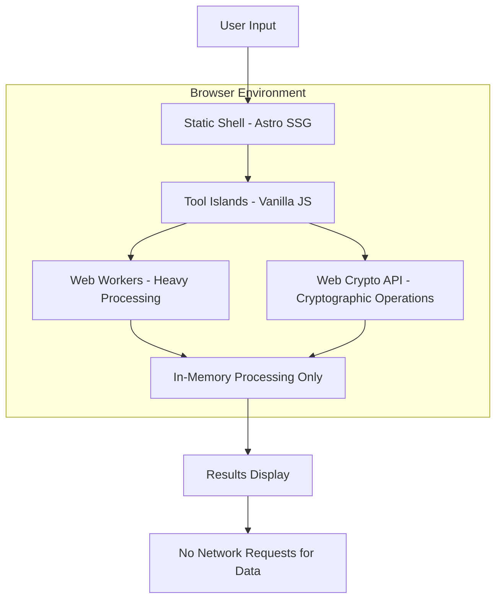

# Design Document

## Overview

DevToolbox is built using Astro's Islands Architecture to achieve optimal performance, SEO, and client-side privacy. The application leverages static site generation for the shell and progressive enhancement for interactive tools, ensuring zero JavaScript is loaded until a user interacts with a specific tool.

The core architectural principle is **progressive enhancement**: the application starts as a static site with perfect SEO and lighthouse scores, then selectively hydrates individual tool "islands" on demand. All data processing occurs in Web Workers to maintain UI responsiveness, with a strict 50MB memory limit to prevent browser crashes.

## Architecture

### High-Level Architecture



### Component Architecture

The application follows a modular island-based architecture:

1. **Static Shell**: Astro-generated HTML with CSS, providing navigation, routing, and SEO metadata
2. **Tool Islands**: Self-contained Vanilla JavaScript modules that hydrate on interaction
3. **Worker Pool**: Shared Web Workers for compute-intensive operations
4. **Crypto Layer**: Native Web Crypto API integration for security operations
5. **State Management**: Ephemeral in-memory state with no persistence

## Components and Interfaces

### Core Application Structure

```
src/
├── layouts/
│   ├── Layout.astro          # Base HTML layout
│   └── ToolLayout.astro      # Tool-specific layout with meta tags
├── pages/
│   ├── index.astro           # Landing page
│   └── tools/
│       ├── json-formatter.astro
│       ├── jwt-decoder.astro
│       ├── base64-encoder.astro
│       ├── crypto-hash.astro
│       ├── timestamp-converter.astro
│       ├── data-converter.astro
│       └── regex-tester.astro
├── components/
│   ├── CommandPalette.astro  # Global search/navigation
│   ├── ThemeToggle.astro     # Dark/light mode toggle
│   └── tools/                # Tool-specific islands
│       ├── JsonFormatter.js
│       ├── JwtDecoder.js
│       ├── Base64Encoder.js
│       ├── CryptoHash.js
│       ├── TimestampConverter.js
│       ├── DataConverter.js
│       └── RegexTester.js
├── workers/
│   ├── json-processor.worker.js
│   ├── crypto-worker.js
│   ├── data-converter.worker.js
│   └── regex-processor.worker.js
└── utils/
    ├── memory-limit.js       # 50MB limit enforcement
    ├── worker-pool.js        # Web Worker management
    └── crypto-utils.js       # Web Crypto API helpers
```

### Tool Island Interface

Each tool follows a consistent interface pattern:

```javascript
class ToolIsland {
  constructor(element) {
    this.element = element;
    this.worker = null;
    this.maxMemoryMB = 50;
  }

  async init() {
    this.bindEvents();
    this.setupWorker();
  }

  async processData(data) {
    if (this.exceedsMemoryLimit(data)) {
      throw new MemoryLimitError('Data exceeds 50MB limit');
    }

    if (this.requiresWorker(data)) {
      return this.processInWorker(data);
    }

    return this.processSync(data);
  }

  bindEvents() { /* Tool-specific event binding */ }
  setupWorker() { /* Initialize Web Worker if needed */ }
  processSync(data) { /* Synchronous processing */ }
  processInWorker(data) { /* Asynchronous worker processing */ }
}
```

### Web Worker Communication

```javascript
// Main thread to worker
worker.postMessage({
  type: 'PROCESS_DATA',
  payload: data,
  options: processingOptions
});

// Worker to main thread
self.postMessage({
  type: 'PROCESSING_COMPLETE',
  result: processedData,
  metadata: { processingTime, memoryUsed }
});

// Error handling
self.postMessage({
  type: 'PROCESSING_ERROR',
  error: { message, code, details }
});
```

## Data Models

### Processing Request Model

```javascript
interface ProcessingRequest {
  type: 'JSON_FORMAT' | 'JWT_DECODE' | 'BASE64_ENCODE' | 'CRYPTO_HASH' | 'TIMESTAMP_CONVERT' | 'DATA_CONVERT' | 'REGEX_TEST';
  payload: string | ArrayBuffer;
  options: {
    format?: 'beautify' | 'minify' | 'tree';
    algorithm?: 'MD5' | 'SHA1' | 'SHA256' | 'SHA512' | 'AES-GCM' | 'RSA';
    encoding?: 'utf8' | 'base64' | 'hex';
    timezone?: string;
    outputFormat?: string;
  };
  metadata: {
    timestamp: number;
    userAgent: string;
    memoryEstimate: number;
  };
}
```

### Processing Result Model

```javascript
interface ProcessingResult {
  success: boolean;
  data: any;
  metadata: {
    processingTime: number;
    memoryUsed: number;
    workerUsed: boolean;
  };
  errors?: Array<{
    code: string;
    message: string;
    line?: number;
    column?: number;
  }>;
}
```

### Tool State Model

```javascript
interface ToolState {
  input: string;
  output: string | null;
  isProcessing: boolean;
  lastProcessed: number;
  errors: ProcessingError[];
  options: Record<string, any>;
}
```

## Error Handling

### Error Categories and Responses

1. **Memory Limit Errors**: Display user-friendly message suggesting CLI tools for large data
2. **Parsing Errors**: Show specific line/column information with syntax highlighting
3. **Crypto Errors**: Provide clear feedback on key format or algorithm issues
4. **Network Errors**: Should never occur for data processing (CSP violation indicator)
5. **Worker Errors**: Graceful fallback to main thread with performance warning

### Error Display Strategy

```javascript
class ErrorHandler {
  static formatError(error, context) {
    switch (error.type) {
      case 'MEMORY_LIMIT':
        return {
          title: 'Data Too Large',
          message: 'Data exceeds 50MB browser memory limits. Please use a local CLI tool for this operation.',
          suggestion: 'Consider processing in smaller chunks or using server-side tools.'
        };

      case 'PARSE_ERROR':
        return {
          title: 'Invalid Format',
          message: `Parse error at line ${error.line}, column ${error.column}`,
          suggestion: 'Check syntax highlighting for specific issues.'
        };

      case 'CRYPTO_ERROR':
        return {
          title: 'Cryptographic Operation Failed',
          message: error.message,
          suggestion: 'Verify key format and algorithm compatibility.'
        };
    }
  }
}
```

## Testing Strategy

### Unit Testing Approach

1. **Tool Logic Testing**: Jest-based tests for each tool's core functionality
2. **Worker Testing**: Dedicated tests for Web Worker communication and data processing
3. **Memory Limit Testing**: Verify 50MB limit enforcement across all tools
4. **Error Handling Testing**: Comprehensive error scenario coverage
5. **Accessibility Testing**: Automated WCAG 2.1 AA compliance verification

### Performance Testing

1. **Lighthouse CI**: Automated performance scoring on every build
2. **Memory Profiling**: Browser DevTools integration for memory usage monitoring
3. **Worker Performance**: Measure processing times for various data sizes
4. **Load Testing**: Verify UI responsiveness during heavy processing

### Security Testing

1. **CSP Compliance**: Verify Content Security Policy prevents unauthorized requests
2. **Data Isolation**: Ensure no data leakage between tool sessions
3. **Crypto Validation**: Test all supported algorithms with known test vectors
4. **Input Sanitization**: XSS prevention in all user input handling

### Browser Compatibility Testing

Target browsers with native Web Worker and Web Crypto API support:
- Chrome 60+
- Firefox 55+
- Safari 11+
- Edge 79+

### Test Structure

```javascript
describe('JsonFormatter Tool', () => {
  describe('Memory Management', () => {
    test('should reject data exceeding 50MB limit');
    test('should route large data to Web Worker');
    test('should display loading state for slow operations');
  });

  describe('JSON Processing', () => {
    test('should validate JSON syntax');
    test('should beautify valid JSON');
    test('should minify JSON correctly');
    test('should handle nested objects and arrays');
  });

  describe('Error Handling', () => {
    test('should display specific parse errors');
    test('should recover gracefully from worker failures');
  });
});
```

This design ensures DevToolbox meets all performance, security, and functionality requirements while maintaining the privacy-first, client-side processing architecture specified in the PRD.